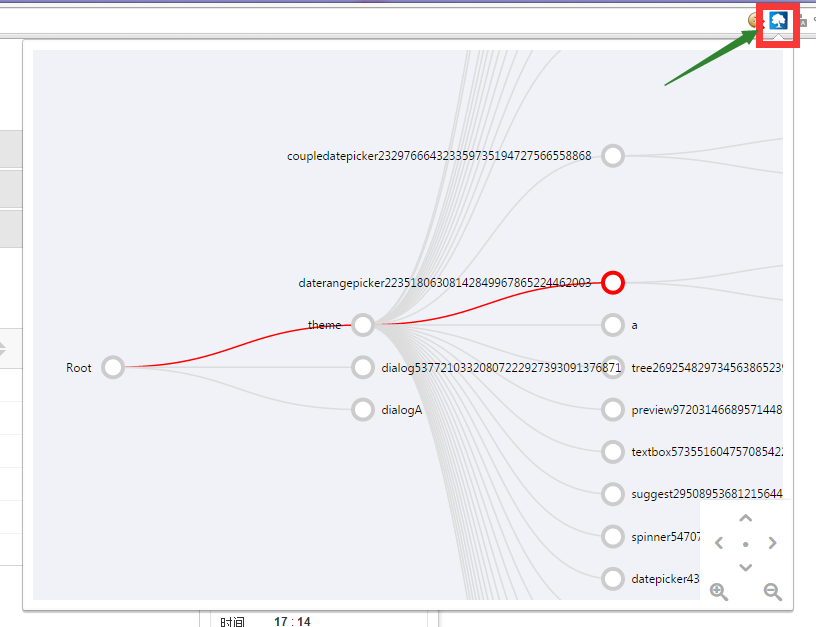

#actree

**actree**是一个展示基于avalon开发的页面的vmodel tree的图形化工具，它会判断用户打开的页面是否基于avalon，如果是则在地址栏出现一个tree icon，点击此icon可以调出vmodel tree，直观的了解到当前页面使用了哪些vmodel，以及所有这些vmodel的嵌套关系，如图：

**注意** Root并不是一个真正意义上的vmodel，因为页面上可能vmodel在同一个深度上，而没有所谓的根，为了看着像个tree，所以虚拟了一个Root出来